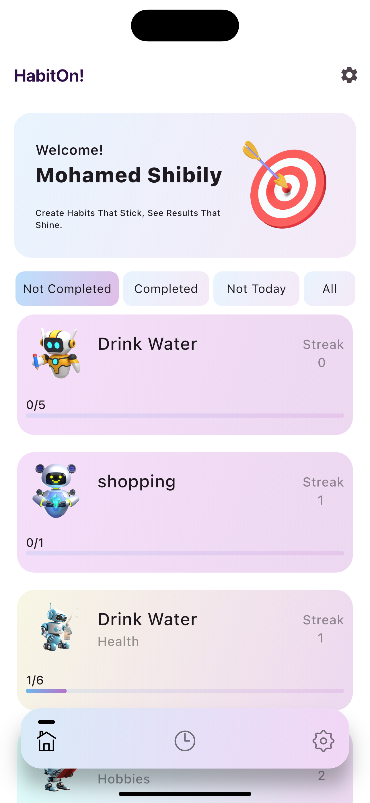
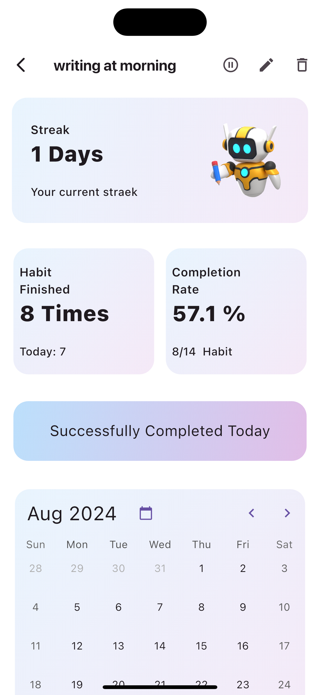
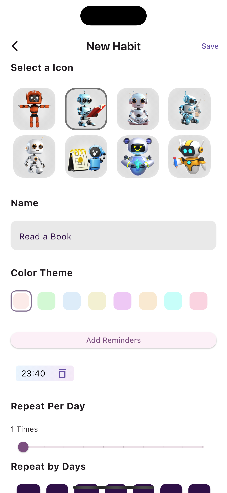
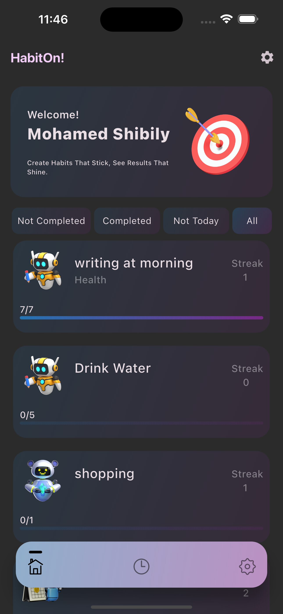
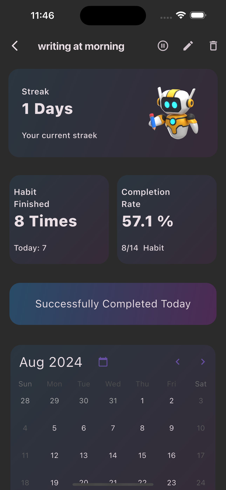
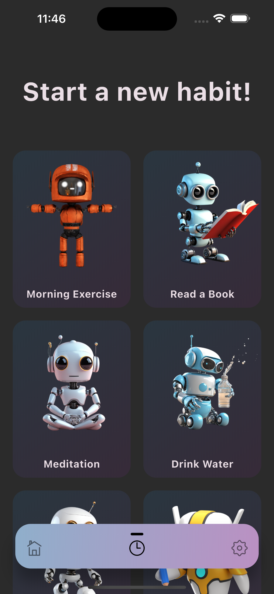

# 🌟 HabitOn - Your Ultimate Habit Tracker 🌟

[](https://flutter.dev/)
[](https://firebase.google.com/)

> **HabitOn** is your personal assistant for building, tracking, and maintaining positive habits. Crafted with precision using Flutter and Firebase, HabitOn is your go-to app for habit formation, providing a clean, intuitive, and powerful experience.

## 🌍 Overview

HabitOn is more than just a habit tracker—it's your path to personal growth. With a focus on a clean architecture and robust state management using the Provider pattern, HabitOn ensures your experience is smooth, responsive, and tailored to your needs.

## ✨ Features

- **🔥 Powerful Habit Tracking**
  - Create and manage habits with custom repeat settings, reminders, and goals.
  - Track progress daily, weekly, or monthly with intuitive charts and insights.

- **🔔 Smart Notifications**
  - Stay on top of your habits with customizable reminders at specific times.
  - Streak alerts to keep you motivated and on track.

- **🌐 Multi-Language Support**
  - Localized content to ensure a seamless experience in your preferred language.
  
- **📊 Analytics & Insights**
  - Detailed statistics to measure your progress and understand your habits.
  - Streak counters, habit completion rates, and more to keep you motivated.

- **🎨 Customizable Themes**
  - Light and Dark themes to suit your style.
  - Personalize the look and feel of your app.

- **🌟 Streak System**
  - Automatic streak tracking with reset if a day is missed.
  - Streak goals to motivate long-term habit formation.

- **📅 Calendar Integration**
  - Visualize your habit completion with a calendar view.
  - Highlight specific days and track your 'done days' with ease.

- **💾 Cloud Sync**
  - Sync your data across devices using Firebase integration.
  - Access your habits anywhere, anytime.

- **🛠️ Clean Code & Architecture**
  - Follows best practices with clean architecture and maintainable codebase.
  - Utilizes the Provider package for efficient state management.

## 🚀 Getting Started

### Prerequisites

Ensure you have the following installed:

- Flutter SDK
- Firebase account
- Git

### Installation

1. **Clone the Repository**

    ```bash
    git clone https://github.com/yourusername/habiton.git
    cd habiton
    ```

2. **Install Dependencies**

    ```bash
    flutter pub get
    ```

3. **Configure Firebase**

    - Follow the official [Firebase documentation](https://firebase.google.com/docs/flutter/setup) to set up Firebase for your Flutter project.

4. **Run the App**

    ```bash
    flutter run
    ```

## 🛠️ Technologies Used

- **Flutter** - UI framework for crafting high-quality native interfaces.
- **Firebase** - Backend services including authentication, database, and cloud storage.
- **Provider** - State management solution for Flutter apps.

## 📸 Screenshots

| Home Screen | Habit Details | New View |
|-------------|---------------|---------------|
|  |  |  |

| Home Screen | Habit Details | New View |
|-------------|---------------|---------------|
|  |  |  |
## 🤝 Contributing

Contributions are welcome! If you have any ideas, suggestions, or improvements, feel free to create an issue or submit a pull request.


## 🎉 Acknowledgments

- Flutter community for continuous support and inspiration.
- Firebase for providing a reliable backend platform.
- All contributors and users who make this project better every day.
